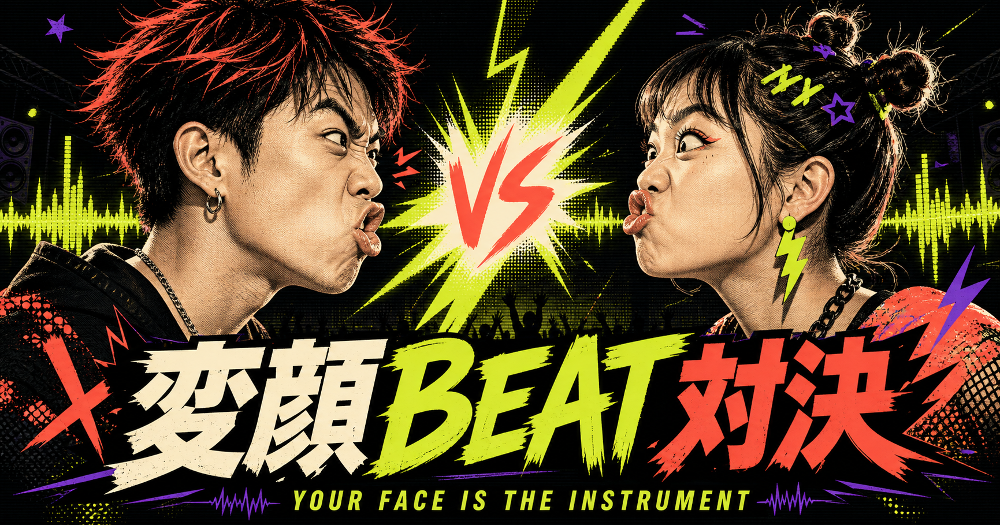
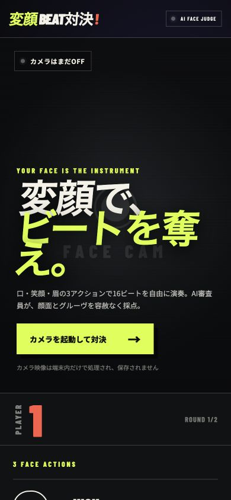
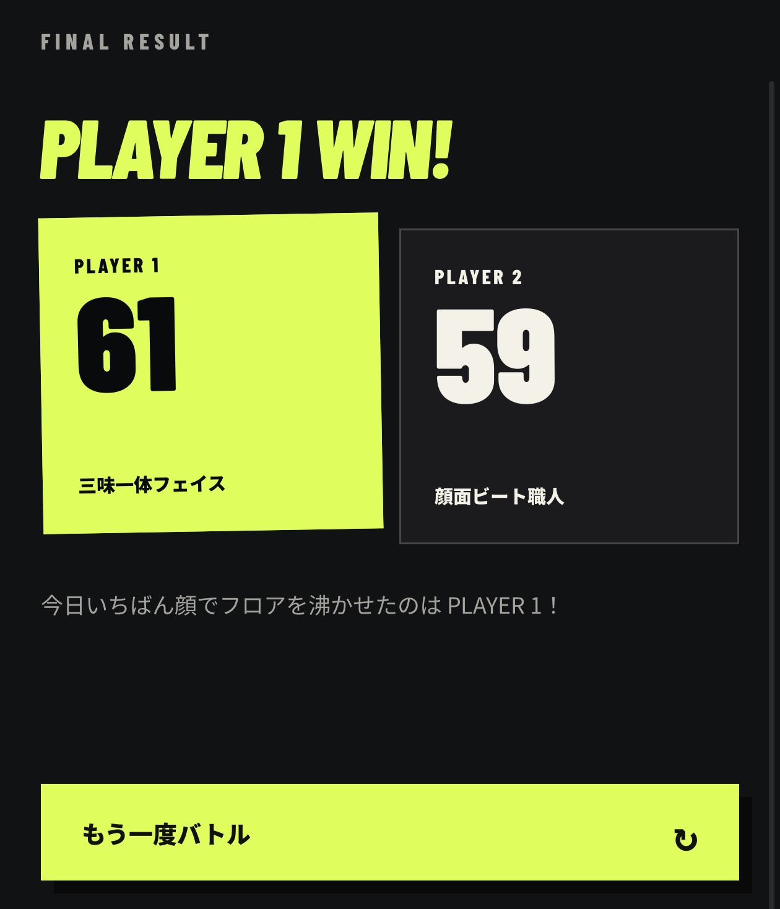

# 変顔BEAT対決

> **今すぐ遊べます → [変顔BEAT対決を起動](https://hengao-beat-battle.natuna.chatgpt.site/?v=2)**



**YOUR FACE IS THE INSTRUMENT.**

口・笑顔・眉の動きをビートへ変え、二人で変顔パフォーマンスを競うモバイルゲームです。黒×アシッドライム×コーラルのアーケード調UIで、カメラ映像は端末内だけで処理します。

MacBookアコーディオンとスマートフォンのセッション構想から、同期問題、スマートフォン単体版への転換を経て現在の形になりました。詳しくは[企画の変遷と今後の構想](docs/PROJECT_JOURNEY.md)にまとめています。

## Mobile UI



## Live Demo

[変顔BEAT対決をスマホでプレイ](https://hengao-beat-battle.natuna.chatgpt.site/?v=2)

iPhone Safariで実機動作を確認済みです。カメラ許可後に`🔊 音声テスト`を押すと、KICK／SNARE／HI-HATを確認できます。

1. `カメラを起動して対決`をタップ
2. 口・笑顔・眉でKICK／SNARE／HI-HATを演奏
3. PLAYER 1とPLAYER 2が順番に16ビートを刻む
4. グルーヴ、変顔力、多彩さ、パワーのスコアで勝負

カメラが使えない環境では、キーボードの`1`・`2`・`3`でも演奏できます。

## Battle Result



## Demo Video

[スマホUIに実演を組み込んだデモ動画](media/videos/hengao-beat-battle-phone-ui-v3.mp4)

[PC対戦UI版のデモ動画](media/videos/hengao-beat-battle-demo-v2.mp4)

## Development

```bash
npm install
npm run dev
npm run build
```

OpenAI HackathonでCodexとGPT-5.6を使って企画・実装・検証しました。

## Privacy

カメラ映像は端末内で処理され、保存されません。
